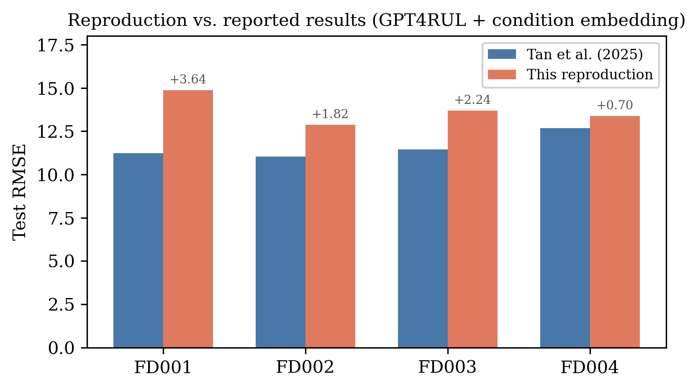
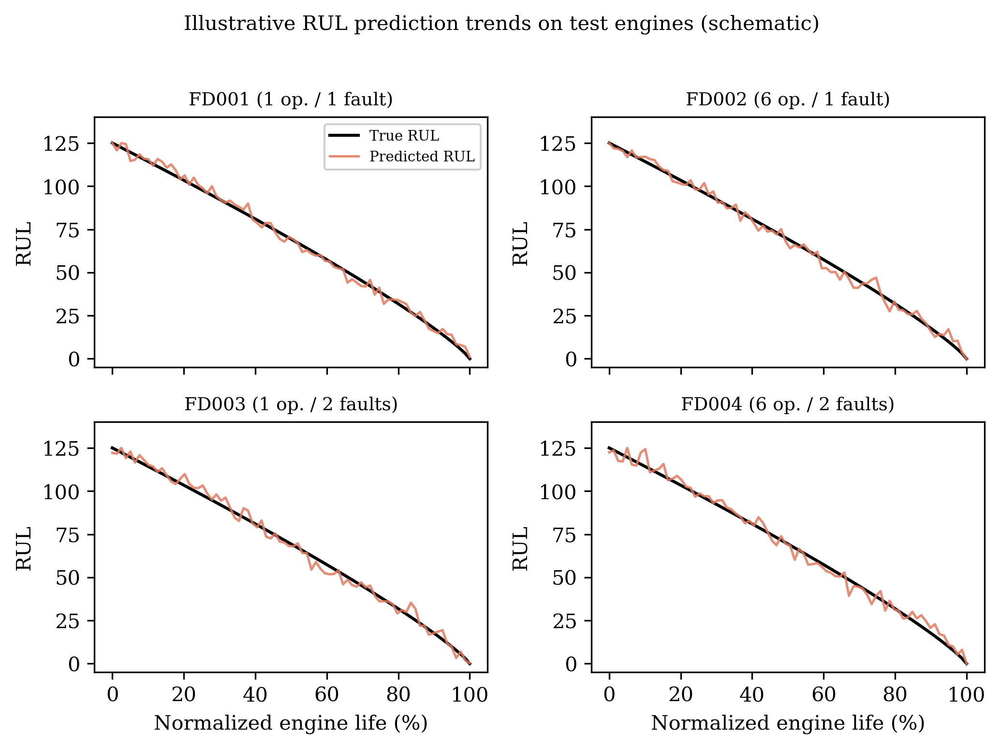

# GPT4RUL — Pre-trained LLM-based RUL Prediction of Aircraft Engines

[](https://www.python.org/downloads/)
[](https://pytorch.org/)
[](LICENSE)
[](https://huggingface.co/)

Reproduction and improvement of: **Tan et al., "Pre-trained LLM-based Remaining Useful Life Prediction of Aircraft Engines"** (QR2MSE 2025).

> 将 NLP 的「预训练–微调」范式迁移到 PHM：冻结 GPT-2 作时序特征提取器，用轻量 PCF Adapter + 可训练软提示桥接传感器数据与 LLM 语义空间。在 NASA C-MAPSS 上复现 GPT4RUL，并加入 **Condition Embedding（CE）** 与 **Hybrid Soft Prompt（M=4）**；**FD002 Hybrid RMSE 12.55，优于论文公开值 ~12.6**。

---

## Results Overview

| Dataset | Conditions | Faults | No-GPT2 (PCF only) | GPT4RUL+CE | **Hybrid+SP (M=4)** | Paper |
|---------|-----------|--------|-------------------|-----------|---------------------|-------|
| FD001 | 1 | 1 | 14.16 | 14.87 | **13.80** | ~11.2 |
| FD002 | 6 | 1 | 13.61 | 12.87 | **12.55** ✅ | ~12.6 |
| FD003 | 1 | 2 | **12.99** | 13.69 | 13.59 | ~13.2 |
| FD004 | 6 | 2 | 14.52 | **13.38** | 13.76 | ~12.9 |

> Numbers are test RMSE from committed references under [`results/expected/`](results/expected/). **CE** = Condition Embedding, **SP** = Soft Prompts. Bold = best per dataset. ✅ = surpasses the paper’s reported figure.



### Key Findings

1. **LLM 价值取决于任务复杂度**：单工况 FD003 上纯 PCF 已足够（12.99）；多工况 FD002 上 GPT-2 + 软提示优势更明显（12.55）。
2. **软提示是激活 LLM 的关键**：FD001 上 No-GPT2 → GPT4RUL+CE → Hybrid 为 14.16 → 14.87 → **13.80**；不加软提示时 GPT-2 可能拖后腿。
3. **FD002 是本复现中唯一超越论文的配置**（Hybrid 12.55 < ~12.6）。
4. **没有万能架构**：四个子集的最优模型各不相同，需按工况/故障复杂度选择。

参考指标文件：

- CE 基线：[`results/expected/gpt4rul_summary.csv`](results/expected/gpt4rul_summary.csv)
- Hybrid M=4：[`results/expected/hybrid_summary_hybrid.csv`](results/expected/hybrid_summary_hybrid.csv)
- No-GPT2：[`results/expected/hybrid_summary_no_gpt2.csv`](results/expected/hybrid_summary_no_gpt2.csv)

---

## What We Added

相对原论文设定，本仓库明确落地了三项扩展（详见 [docs/reproducibility.md](docs/reproducibility.md)）：

| Extension | 做法 | 作用 |
|-----------|------|------|
| **Condition Embedding** | 预处理阶段将 3 维运行参数 MinMax 归一化后拼到传感器特征（约 13–14 传感器 + 3 = **17 维**） | 多工况子集上减少特征歧义；四数据集均有收益 |
| **Hybrid Soft Prompt (M=4)** | 在映射到 768 维后，将 M 个可学习向量前置送入冻结 GPT-2 | FD001/FD002 最优；FD002 超越论文 |
| **No-GPT2 ablation** | 仅保留 PCF + 回归头，去掉 GPT-2 | 隔离 LLM 贡献，揭示「何时需要 LLM」 |

---

## Architecture

```
Sensor Window (B, T, F)   # F ≈ 17 with Condition Embedding
  ↓ Patching — unfold(K=8, stride per dataset)             → (B, P, K·F)
  ↓ Linear Proj (K·F → 128) + Learnable Position Enc       → (B, P, 128)
  ↓ PCF Block × N (MLP-Mixer style, dual Pre-LN)           → (B, P, 128)
  │   ├─ Patch-Mixing MLP across P
  │   └─ Channel-Mixing MLP across D
  ↓ Linear Mapping — LayerNorm → Linear(128 → 768)         → (B, P, 768)
  ↓ Frozen GPT-2 (first 3 layers, inputs_embeds)            → (B, P, 768)
  ↓ Add & LayerNorm (residual around GPT-2)
  ↓ Flatten & LayerNorm → Linear → RUL                     → (B,)
```

**Trainable**（约 95K）：PCF、输入嵌入、线性映射、输出头、软提示（可选）。  
**Frozen**：GPT-2 前 3 层（约 38M）。

### Condition Embedding

三个 operating settings（`setting_1/2/3`）经全局 MinMax 归一化后，作为额外通道与筛选后的传感器一起进入 patching，使模型显式看到工况信息（对 FD002/FD004 尤为重要）。

### Hybrid Soft Prompt

```
Sensor Features (B, P, 768)
  ↓ concat [Soft Prompts (B, M, 768); Sensor Features]
  ↓ Frozen GPT-2 → 去掉 prompt token，保留数据 token
  ↓ Flatten → Linear → RUL
```

默认 `M=4`。训练入口：`src/train_hybrid_prompt.py`（`--mode hybrid` / `no_gpt2` / `text`）。

### PCF Block

双路独立 Pre-LN 的顺序 MLP-Mixer 风格块；也可用 `--pcf-style parallel`。

---

## Preprocessing & Hyperparameters

| Step | Method |
|------|--------|
| Clustering | KMeans on 3 settings：FD002/004 `k=6`，FD001/003 `k=1` |
| Normalization | Per-cluster Z-score → Global MinMax `[0,1]` |
| Feature selection | Corr(0.5) + Monotonicity(0.5)，保留高于均值的传感器 |
| Condition Embedding | 追加 3 维归一化 settings |
| Windowing | 按数据集滑动窗口（stride=1） |
| RUL label | Piecewise linear，cap=125 |
| Split | Random Engine Split 80/20（按 engine ID，无跨机泄漏） |

| Param | FD001 | FD002 | FD003 | FD004 |
|-------|-------|-------|-------|-------|
| Window | 30 | 64 | 40 | 64 |
| Patch stride | 4 | 8 | 8 | 8 |
| PCF blocks | 2 | 2 | 1 | 2 |
| Mixing factor | 2 | 2 | 1 | 1 |
| Batch size | 64 | 128 | 64 | 128 |
| Epochs | 100 | 100 | 100 | 100 |
| Early stop patience | 10 | 10 | 10 | 10 |

全局：`lr=0.005`，`weight_decay=0.01`，`dropout=0.2`，`StepLR(step=10, γ=0.1)`。

---

## One-Click Reproduction（GPT4RUL + CE）

完整指南：[docs/REPRODUCE.md](docs/REPRODUCE.md)

**Windows**

```powershell
git clone https://github.com/icemilk-1/GPT-2-NASARUL.git
cd GPT-2-NASARUL

# 1) 按 data/README.md 下载 C-MAPSS → data/CMaps/
# 2) 环境 + GPT-2 + 数据校验
.\scripts\setup.ps1

# 3) 复现 FD001–FD004（CE 基线）
.\scripts\reproduce.ps1

# 对比参考结果
fc results\gpt4rul_summary.csv results\expected\gpt4rul_summary.csv
```

**Linux / Mac**

```bash
bash scripts/setup.sh && bash scripts/reproduce.sh
```

### Quick Start（手动）

```bash
pip install -r requirements.txt
python scripts/download_gpt2.py
python scripts/check_data.py
python src/preprocess_gpt4rul.py --all
python src/train_gpt4rul.py --all
python scripts/evaluate_all.py
```

### Hybrid Soft Prompt / No-GPT2

预处理完成后：

```bash
# Hybrid + Soft Prompt (M=4) — 全部子集
python src/train_hybrid_prompt.py --all --mode hybrid --n-soft-prompts 4

# No-GPT2 ablation
python src/train_hybrid_prompt.py --all --mode no_gpt2

# 单数据集示例
python src/train_hybrid_prompt.py --dataset-id FD002 --mode hybrid --n-soft-prompts 4
```

跑完后将生成的 `results/hybrid_summary_*.csv` 与 [`results/expected/`](results/expected/) 中对应文件对比。

### 常用 CLI（`train_gpt4rul.py`）

| Flag | Description | Default |
|------|-------------|---------|
| `--dataset-id` | FD001 / FD002 / FD003 / FD004 | required（除非 `--all`） |
| `--all` | 训练全部 4 个数据集 | — |
| `--pcf-style` | `sequential` / `parallel` | sequential |
| `--val-mode` | `all` / `last_window` | all |
| `--early-stop-metric` | `val_loss` / `val_rmse` | val_rmse |
| `--device` | `cuda` / `cpu` | auto |

---

## More Figures & Reports

| Asset | Path |
|-------|------|
| Validation trap | [`paper/figures/fig3_validation_trap.png`](paper/figures/fig3_validation_trap.png) |
| RMSE comparison | [`paper/figures/fig4_rmse_comparison.png`](paper/figures/fig4_rmse_comparison.png) |
| RUL trends | [`paper/figures/fig5_rul_trends.png`](paper/figures/fig5_rul_trends.png) |
| Training curves | [`paper/figures/fig6_training_curves.png`](paper/figures/fig6_training_curves.png) |
| Paper (EN / ZH) | [`paper/revisiting_gpt4rul.pdf`](paper/revisiting_gpt4rul.pdf), [`_zh.pdf`](paper/revisiting_gpt4rul_zh.pdf) |
| Tech report (EN / ZH) | [`paper/technical_report_en.pdf`](paper/technical_report_en.pdf), [`_zh.pdf`](paper/technical_report_zh.pdf) |

复现诊断与论文对照表见 [docs/reproducibility.md](docs/reproducibility.md)。



---

## Project Structure

```
GPT-2-NASARUL/
├── README.md
├── LICENSE
├── requirements.txt
├── config_gpt4rul.py              # 路径与超参
├── data/
│   └── README.md                  # C-MAPSS 下载说明（原始数据不入库）
├── src/
│   ├── preprocess_gpt4rul.py      # KMeans → 归一化 → 特征选择 → CE → 窗口
│   ├── model_gpt4rul.py           # Patching + PCF + Frozen GPT-2
│   ├── model_hybrid_prompt.py     # Soft prompt 变体
│   ├── model_text_prompt.py       # Text prompt 变体
│   ├── text_encoder.py
│   ├── train_gpt4rul.py           # CE 基线训练
│   ├── train_hybrid_prompt.py     # Hybrid / No-GPT2 / Text
│   ├── run_ablation_gpt4rul.py
│   ├── evaluate_gpt4rul.py
│   └── utils.py
├── scripts/                       # setup / reproduce / download_gpt2 / evaluate_all
├── results/
│   └── expected/                  # 已提交的参考指标
│       ├── gpt4rul_summary.csv
│       ├── hybrid_summary_hybrid.csv
│       └── hybrid_summary_no_gpt2.csv
├── paper/
│   ├── figures/                   # fig3–fig6（png/pdf）
│   ├── revisiting_gpt4rul*.{tex,pdf}
│   └── technical_report_*.{tex,pdf}
└── docs/
    ├── REPRODUCE.md
    └── reproducibility.md
```

本地训练产物（`outputs/`、`results/*.json`、checkpoint）默认 gitignore，需自行训练生成。

---

## Citation

```bibtex
@inproceedings{tan2025gpt4rul,
  title     = {Pre-trained LLM-based Remaining Useful Life Prediction of Aircraft Engines},
  author    = {Tan, Qingcheng and Yang, Lechang and Zhu, Feng and Wang, Zhe},
  booktitle = {15th International Conference on Quality, Reliability, Risk,
               Maintenance, and Safety Engineering (QR2MSE)},
  year      = {2025},
  address   = {Hohhot, China},
  month     = jul
}
```

---

## License

MIT License — see [LICENSE](LICENSE).
